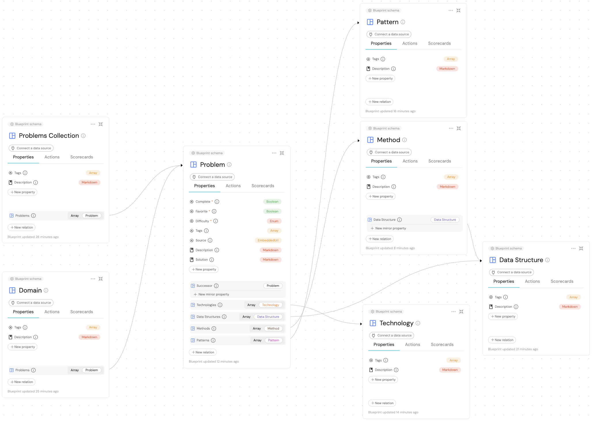

[](https://github.com/evarga/idp-career/actions/workflows/pylint.yml)
# Introduction
This project is used as an educational material to teach and demonstrate in practice the following topics:

- What is an internal developer portal (IDP) and how to leverage it for career development and management in the software tech industry.
- Introduction to [Port](https://www.getport.io/) IDP and how it helps realize the [platform engineering](https://platformengineering.org) paradigm.
- How to provision infrastructure in automated fashion using Port [Restful API](https://docs.getport.io/build-your-software-catalog/custom-integration/api/), a concept known as [infrastructure as code](https://www.pulumi.com/what-is/what-is-infrastructure-as-code/) (IaC).
- The automation of software development lifecycle (SDLC) tasks using GitHub Actions and why Python linting is important.
- How to properly manage secrets in an application.

## What is an Internal Developer Portal (IDP)?
_An IDP is an operating platform that lies between the developers and the platforms they need and provides a product-like user interface that enables developers to access and manage the tools, components and services they need for their software development._ It reduces the cognitive load and helps realize the [platform engineering](https://platformengineering.org) paradigm. An IDP also serves as a source of truth related to enterprise assets by providing a sophisticated software & API catalog. Read [this](https://www.getport.io/blog/developer-portal) blog to learn more about the concept of an IDP and why it is needed in the context of complex software architectures. The article also introduces Port, a solution for building and managing IDPs. An IDP also complements the overall efforts in documenting and visualizing a data architecture of an enterprise; see [this](https://www.linkedin.com/advice/0/what-data-architecture-tools-do-you-use-measure?utm_source=share&utm_campaign=copy_contribution_link&utm_medium=guest_desktop&contributionUrn=urn%3Ali%3Acomment%3A%28articleSegment%3A%28urn%3Ali%3AlinkedInArticle%3A7099447612952489984%2C7099447617763368960%29%2C7101654580907696128%29&articleSegmentUrn=urn%3Ali%3AarticleSegment%3A%28urn%3Ali%3AlinkedInArticle%3A7099447612952489984%2C7099447617763368960%29&dashContributionUrn=urn%3Ali%3Afsd_comment%3A%287101654580907696128%2CarticleSegment%3A%28urn%3Ali%3AlinkedInArticle%3A7099447612952489984%2C7099447617763368960%29%29) comment as a possible answer for why and how.

💪The IDP improves developers' experience, productivity and retention, as well as supports platform engineering as a practice. [The Definitive Guide to Internal Developer Portals](https://www.getport.io/blog/guide-to-internal-developer-portals) describes the features and principles of a good internal developer portal, such as being product-like, decoupled, compliant, secure, central, self-service and API-first.

An IDP brings together various stakeholders in the organization, such as developers, platform engineers, product managers, security and compliance teams, and helps them collaborate and communicate effectively. It constitutes a single entry point for the organization's software assets and provides a unified interface for managing them. It also helps in enforcing best practices, standards and policies across the organization. The next figure illustrates the role of an IDP in the context of a software development organization.

<kbd></kbd>

Besides tracking enterprise assets Port, and most other IDPs, allows you to create custom [dashboards](https://www.getport.io/blog/announcing-dashboards) for your team, project, or organization. You can add widgets to your dashboard to display information from various sources, such as GitHub, Jira, Jenkins, and more. You can also create custom widgets to display information from your own internal systems. 

## Getting Started with Port
The [Port Academy](https://www.youtube.com/playlist?list=PLTwEf67PTkOvH2z55uxJr0ftc7qUHwK6A) video lectures explain with examples of all the building blocks of Port. It is the easiest way to fathom creation of blueprints, how to ingest data into a catalog, setup RBAC as well as implement self-service actions. It also gives hints what sorts of automations are possible via Port through the workflow automation mechanism. [This](https://youtu.be/fi611swFHyY) webinar produced by the Port company expands on academy lessons by presenting an end-to-end case study that demonstrates all the key features of Port. More specifically, it illustrates the following possibilities:

- Ingesting cloud infrastructure data and keeping it in-sync inside Port. The webinar uses AWS Exporter to import resources like ECS instances, S3 buckets, API Gateways, Lambda functions, etc. The approach is the same for other cloud providers, too.
- It sheds lite why it is crucial to have a full picture of how things are connected in a complex architecture. Serverless architectures more or less have the same issues as ESBs and streaming data platforms (like Kafka). Namely, small dispersed processing units are hard to track, and it is cumbersome to perform changes. This is where an IDP helps in connecting the dots and allows self-service actions to happen right from the UI without knowing all the gory technical details.  

### The Importance of a Data Model
The software catalog is the central building block of Port that provides visibility into an enterprise. It consists of two parts: blueprints and entities. The former is a set of schema definitions, akin to database table schemas, based on which instances are created (these are called entities). The story always begins with a data model. Afterward, data may be ingested either manually or programmatically. Once everything is inside Port, self-service actions may be specified, allowing developers to execute background tasks prepared by platform engineers. In this way, any member of a feature team would be able to scaffold a new service, perform day-2 actions (like deploying a service into a target environment, etc.) without a need to contact anybody else. Besides, scorecards may be attached to entities illuminating KPIs and healthiness of components and/or productivity of users/teams. Dashboards are a way to show insights in the form of live reports (for example, a cycle time of a service). All things done in Port are controlled by RBAC even at the level of individual properties (fields) of blueprints. The [Building a Fully Operational Internal Developer Platform](https://youtu.be/_i4vMfznw7Y) webinar showcases all the previously mentioned elements together with an example how to evolve an existing data model as well as how to combine various segments of a model into a unified view. Finally, the [What do we mean when we say "data model"?](https://www.youtube.com/watch?v=EW3iHlC-xq0) webinar goes into details how to start with an MVP and later extend the data model to cover additional use cases.

IDPs can enable developer self-service actions using infrastructure as code (IaC) and GitOps under the hood. These are practices that can improve the developer experience, but they also require a high level of expertise and trust from the developers and the devops. IDPs can provide a product-like user interface that abstracts away the complexity and the risk of these practices, and allows developers to perform self-service actions with guardrails and golden paths in place. Port is a solution for building and managing internal developer portals that supports webhooks, Kafka, Terraform and Pulumi as ways to enable self-service actions. The blog [Internal Developer Portals: self-service actions using infrastructure as code and GitOps](https://www.getport.io/blog/internal-developer-portals-self-service-actions-using-infrastructure-as-code-and-gitops) ties the above concepts together through one full case study. There is a link to the matching webinar from the article that should be also watched.

The beauty of Port is that self-service actions may be setup to require manual approval by a manager. This is where RBAC comes into play. For example, one can define a self-service action to promote a service as production ready, thus enabling deployment into a production environment.

### How Port Supports Security and Compliance
The AppSec teams can use IDPs to help developers' own security by providing them with relevant information and actions in context. Developers need security information, in context, to be able to deal with vulnerabilities and misconfigurations in their software development life cycle. Port can be a centralized hub for security information, unifying data from different tools and different stages of the software development life cycle. The article [Why Appsec Teams Need Internal Developer Portals](https://www.getport.io/blog/why-appsec-teams-need-internal-developer-portals) explains how IDPs can leverage the power of platform engineering to provide developers with a better context for dealing with vulnerabilities and misconfigurations. It demonstrates how Port can be used to create vulnerability and misconfiguration blueprints, define self-service actions and automation, and communicate security expectations and status using scorecards. The article concludes by stating that internal developer portals can help developers own AppSec by creating a better context for dealing with vulnerabilities and misconfigurations in the internal developer portal.

Port maintains active SOC 2 Type II compliance. This [page](https://www.getport.io/security) describes in detail all the security features of the Port as well as security procedures in place inside the company who built the Port. Port can help in meeting significant part of the requirements pertaining to the [EBA](https://www.eba.europa.eu/) regulation.

# Usage
This project hosts two Python scripts for managing Port resources. Here are the steps to run them:

- Create an account on the [Port](https://www.getport.io/) website. Use the free plan to get started.
- Open [GitHub Codespaces](https://codespaces.new/evarga/idp-career) and wait until the container is fully setup; the last step installs dependencies as specified in the package descriptor. Of course, you may also opt to set up everything on your local machine.
- Set the following environment variables in the terminal (follow the instructions [here](https://docs.getport.io/build-your-software-catalog/custom-integration/api/#find-your-port-credentials) to get the credentials):
  ```bash
  export PORT_CLIENT_ID=<your_port_client_id>
  export PORT_CLIENT_SECRET=<your_port_client_secret>
  ```
- From the project _root_ directory, run the desired script (these are explained below).

## Setup of the Data Model
The `create_data_model.py` script will create a data model for managing problems typical for interviews and competitive programming. It is useful when you want to set up the resources for the first time. The data model is fully documented (hover over a circle with letter _i_ inside), and is depicted on the figure below. Port doesn't show self-references, so the figure is simplified. The model is _centered_ around the `Problem` blueprint, since the solution of a problem drives everything, and resembles the [snowflake schema](https://en.wikipedia.org/wiki/Snowflake_schema). If there are associated methods or patterns, then all of them will be mentioned and referenced as part of a solution. This is why more complex modeling of other artifacts is not done here.

<kbd></kbd>

To run the script, execute the following command in the terminal (you can also instruct the script to install sample data):
```bash
python create_data_model.py [--install-sample-data]
```

From here, you may add entities (instances of blueprints) to the catalog, or you may extend the data model to cover additional use cases[^1]. You may also create self-service actions to automate common tasks, such as adding a new problem or solution, or updating an existing one. The possibilities are endless, and the only limit is your imagination[^2].

## Cleanup of Resources
The `clean.py` script will delete all the blueprints, located inside the `assets/blueprints` folder, and their entities. To retain the data model, you may pass the `--retain-data-model` command line argument. This script is useful when you want to make a fresh start from scratch or when you want to clean up the software catalog after you are done with the demo.

To run the script, execute the following command in the terminal:
```bash
python clean.py [--retain-data-model]
```

# Conclusion
You have witnessed the power of an IDP and how it can be used to manage software assets in an automated fashion. You have also learned how to leverage the Pulumi Port resource provider to manage Port resources programmatically. This educational unit has used Port in an unusual manner for tracking career related assets as well as organizing materials for teaching. There are many benefits of using Port for this purpose, some of them are enrolled below:

- Provide a single entry point for all problems scattered over many platforms, like, [LeetCode](https://leetcode.com), [Codeforces](https://codeforces.com), [CodeChef](https://www.codechef.com), etc.
- Organize data in a way that suits your needs without being locked into disparate models of other platforms.
- Automate common tasks, such as adding a new problem or solution, or updating an existing one.
- Using RBAC, you may control who can see and modify what. For example, you can expose only a selected set of problems to students of your class with read-only access.
- Create custom dashboards to visualize data in a way that makes sense to you. For example, you can create a pie chart showing the distribution of problems by difficulty level or by topic.
- You can navigate relationships and find concrete problems for specific data structures or algorithms.
- You can collect many additional notes and resources related to a problem, data structure or method, like a video tutorial, a blog post, a book chapter, etc.

[^1]: Ensure that all such changes are reflected in the script, so that the data model is always in sync with the code.
[^2]: An efficient way to organize your assets if to use [folders](https://www.getport.io/blog/curate-personalized-experiences-with-folders). They allow an extra level of hierarchy in the catalog. For example, you may create the next top level folders: Teaching, Interview Preparation and Competitive Programming Preparation.